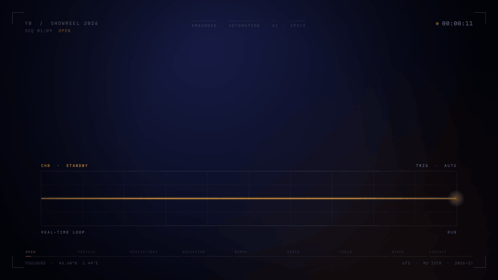

  

<h1 align="center">Younes Bouzateur</h1>

  <b>Étudiant ingénieur — Master 2 ISTR (Ingénierie des Systèmes Temps Réel)</b> 
  Université Paul Sabatier (UT3), Toulouse 
  <em>Systèmes embarqués · Automatisme · IA · Spatial</em>

  
  
  
  

---

## 👋 En bref

Étudiant en **Master 2 ISTR** à l'Université Paul Sabatier, je conçois des systèmes qui doivent réagir en temps réel : du microcontrôleur à l'automate industriel, de la vision par IA à l'estimation d'orbite.

- 🛰️ **NIMPH** : estimateur d'orbite de nanosatellite par filtre de Kalman étendu, **91 % de fusion des mesures** sur données TLE Galileo
- 🏆 **AEGIS** : détection d'incendies par drones avec YOLOv8, **1ʳᵉ place sur 30 équipes** à l'AEC 2025
- 🏭 **Terrain** : stages en conception électrique (EPLAN P8) et en automatisme industriel
- 🔭 Je recherche un **stage de fin d'études à partir de mars 2027** (ou une **alternance dès octobre 2026**) dans le spatial, l'aéronautique, l'énergie ou les systèmes embarqués critiques

---

## 🎬 Showreel

<!-- 👉 Dans l'éditeur GitHub, glisse ici le fichier Younes_Bouzateur_Showreel_GitHub.mp4, attends la fin de l'envoi, puis supprime ce commentaire. -->

*30 secondes sur mon parcours, mes projets et mes compétences (son recommandé).*

---

## 🚀 Projets phares

| Projet | Description | Stack |
|--------|-------------|-------|
| [**NIMPH — Estimation d'orbite**](https://github.com/1xyounes/nimph-orbital-ekf) | Filtre de Kalman étendu en éléments képlériens et équinoxiaux, appliqué au satellite Galileo GSAT0232 · **91 % de fusion des mesures** | Python |
| [**AEGIS — AEC 2025 🏆**](https://github.com/1xyounes/Project-aec2025) | Détection d'incendies par YOLOv8 et coordination d'une flotte de drones · **1ʳᵉ place sur 30 équipes** | Python · YOLOv8 |
| [**Perception véhicule autonome**](https://github.com/1xyounes/CARLA-YOLOv8-Autonomous-Perception) | Entraînement d'un modèle YOLOv8 sur le simulateur CARLA pour la conduite autonome | Python · CARLA |
| [**Commande d'ascenseur (PLC)**](https://github.com/1xyounes/elevator-plc-s7-1200) | Programme d'un automate Siemens S7-1200 sous TIA Portal V17 | Ladder · S7-1200 |
| [**Borne de recharge électrique**](https://github.com/1xyounes/projetuml-borne) | Développement en C sous Linux et modélisation de l'architecture en UML | C · UML |
| **Maison autonome (domotique)** | Capteurs et actionneurs pilotés par une carte Arduino | Arduino |

---

## 💼 Expériences

**Stagiaire Conception Électrique &amp; Automatisme** — *ELECTEAM E&amp;C, Alger* · mars – avril 2025
- Schémas électriques de puissance et de commande sous **EPLAN P8**
- Câblage et filerie d'armoires de commande industrielles avec les techniciens
- Suivi complet, de la conception numérique à l'assemblage physique

**Stagiaire Automatisme &amp; Contrôle** — *Easy Emballage, Alger* · mars – avril 2024
- Analyse du cycle de production complet d'une installation industrielle
- Assistance technique lors des arrêts de ligne (diagnostic et dépannage)
- Collaboration avec les équipes Production et Maintenance pour optimiser les flux

---

## 🎓 Formation

| Période | Formation | Établissement |
|---------|-----------|---------------|
| 2026 – aujourd'hui | **Master 2 Ingénierie des Systèmes Temps Réel (ISTR)** | Université Paul Sabatier (UT3), Toulouse |
| 2025 – 2026 | **Master 1 ISTR** — validé | Université Paul Sabatier (UT3), Toulouse |
| 2023 – 2025 | **Cycle ingénieur — Automatique &amp; Informatique industrielle** | ENSTA, Alger |
| 2021 – 2023 | **Cycle préparatoire (Sciences &amp; Technologies)** — *classé top 9 %* | ENSTA, Alger |
| 2021 | **Baccalauréat Mathématiques** — mention Très Bien | Lycée Colonel Amirouche, Alger |

> **Cours clés :** systèmes linéaires asservis (performance et robustesse), systèmes à événements discrets, microcontrôleurs, traitement d'images, automatique avancée (non linéaire, multivariable, espace d'état, régulation numérique), robotique et IA, systèmes embarqués, électronique de puissance.

---

## 🛠️ Compétences

**Embarqué &amp; temps réel**

  
  
  
  
  
  

**Langages**

  
  
  
  
  
  

**IA &amp; data**

  
  
  
  

**Automatisme &amp; outils**

  
  
  
  
  
  

---

## 🌍 Langues &amp; activités

| Langue | Niveau |
|--------|--------|
| Français | TCF B2 |
| Anglais | EFSET C1 |
| Arabe | Langue maternelle |

- 🥋 **Jiu-jitsu brésilien** : pratique en club et compétitions régionales
- 🤝 **Associatif** : membre actif du club scientifique Plug In et de son équipe de compétition

---

## 📊 Statistiques GitHub

  
  

